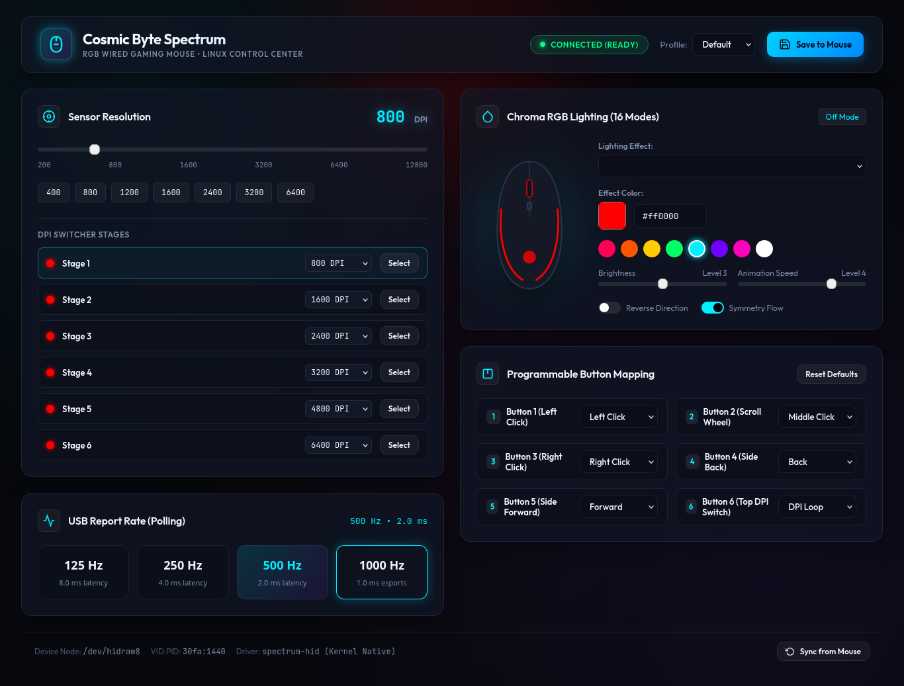

# Cosmic Byte Spectrum Driver Linux

[](#license)
[](#)
[](#)

A fast, native Linux driver, CLI utility (`spectrumctl`), and modern glassmorphic Web GUI Control Center (`spectrum-gui`) for the **Cosmic Byte Spectrum RGB Gaming Mouse** (SKU: `TCBP03429`, EAN: `8906107601954`, USB VID: `0x30fa`, PID: `0x1440`).

---

## 📸 Demonstration



---

## ⚡ Quick Start (Only 2 Commands!)

No complex setup required. After downloading or cloning, simply run:

```bash
git clone https://github.com/nonbothack/Cosmic-Byte-Spectrum-Driver-Linux.git
cd Cosmic-Byte-Spectrum-Driver-Linux && ./run-gui.sh
```

**That's it!** The driver auto-discovers your mouse and immediately opens the interactive Control Center in your browser at [`http://127.0.0.1:4567`](http://127.0.0.1:4567).

---

## 🖥️ System & Desktop App Install (1 Command)

To install the desktop launcher and terminal commands globally on your machine:

```bash
./install.sh
```

- Adds **"Cosmic Byte Spectrum Control Center"** to your Linux application menu (press Super / Windows key to search).
- Installs `spectrum-gui` and `spectrumctl` to your PATH.
- Configures non-root udev access rules.

---

## 💻 CLI Quick Controls (`spectrumctl`)

Prefer configuring via terminal? It only takes a single command:

```bash
# Read all current mouse settings
spectrumctl get

# Set Esports 1000 Hz report rate (125, 250, 500, 1000 Hz)
spectrumctl polling set 1000

# Set active DPI resolution (200 - 12,800 DPI)
spectrumctl dpi set 800

# Set RGB Lighting Effect (16 hardware modes)
spectrumctl rgb set --mode neon
spectrumctl rgb set --mode breathing --color "#00ffcc"

# Permanently commit settings to mouse onboard EEPROM flash
spectrumctl save
```

---

## 🎮 Hardware Support Matrix

| Feature | Hardware Status | Linux CLI (`spectrumctl`) | Desktop GUI (`spectrum-gui`) |
|---|:---:|:---:|:---:|
| **Device Detection** | ✅ Supported | ✅ `spectrumctl list` | ✅ Live Status Indicator |
| **DPI Configuration (200–12,800)** | ✅ Supported (23 steps) | ✅ `spectrumctl dpi set` | ✅ Interactive Slider & Chips |
| **DPI Switcher Stages** | ✅ Supported (6 stages) | ✅ Active Queue | ✅ Visual Stage Matrix |
| **USB Polling Rate (125–1000 Hz)** | ✅ Supported | ✅ `spectrumctl polling set` | ✅ Tactile Latency Tiles |
| **16 Hardware RGB Modes** | ✅ Supported | ✅ `spectrumctl rgb set` | ✅ Real-time Mouse Schematic Glow |
| **RGB Custom Color & Brightness** | ✅ Supported | ✅ Hex & 4-bit nibbles | ✅ Palette Picker & Sliders |
| **Programmable Button Remapping** | ✅ Supported (6 buttons) | ✅ `spectrumctl button set` | ✅ Interactive Remap Grid |
| **Host Profiles** | ✅ Supported | ✅ TOML storage | ✅ Quick Switcher |
| **Onboard Flash Commit** | ✅ Supported | ✅ `spectrumctl save` | ✅ Save to Mouse Button |
| **Firmware Flash/Brick Risk** | ❌ Excluded (Safety) | ❌ Safe by Design | ❌ Safe by Design |

---

## 🏗️ Architecture Overview

```text
       spectrum-gui (Desktop Web Dashboard)      spectrumctl (CLI Harness)
                              │                                │
                              └───────────────┬────────────────┘
                                              ▼
                                 crates/spectrum-core
                             (High-Level Device Service)
                                              │
                              ┌───────────────┴────────────────┐
                              ▼                                ▼
                    crates/spectrum-protocol           crates/spectrum-hid
                    (Packets, Opcodes, Stages)      (Linux /dev/hidraw ioctl)
                                                               │
                                                               ▼
                                                      /dev/hidraw5 (Interface 1)
                                                      Cosmic Byte Spectrum Mouse
```

- **`crates/spectrum-protocol`**: Pure protocol codec. Encodes and decodes 8-byte HID feature reports, converts 23 DPI steps, 4-bit inverted color nibbles, button action codes, and EEPROM chunks.
- **`crates/spectrum-hid`**: Transport layer. Auto-discovers the vendor interface (Interface 1) via sysfs and issues Linux `HIDIOCSFEATURE` / `HIDIOCGFEATURE` ioctls with seamless reconnect resilience.
- **`crates/spectrum-core`**: High-level device service trait `SpectrumDevice`, state manager, and host profile serialization.
- **`crates/spectrum-cli`**: Command-line tool `spectrumctl`.
- **`crates/spectrum-ui`**: Embedded glassmorphic desktop GUI `spectrum-gui`.

---

## 🔒 Safety & Device Integrity

- **Pointer Protection:** Standard pointer tracking, clicks, and scroll wheel remain completely functional at all times via Linux `hid-generic` on Interface 0.
- **Disassembled Accuracy:** Every command opcode and payload structure is derived from hardware report descriptors and verified disassembly of the OEM firmware communication layer.
- **Firmware Safety:** Firmware update operations are intentionally excluded to prevent any risk of bricking the physical hardware.

---

## 📜 License

Dual-licensed under either:
- [MIT License](LICENSE-MIT)
- [Apache License, Version 2.0](LICENSE-APACHE)
